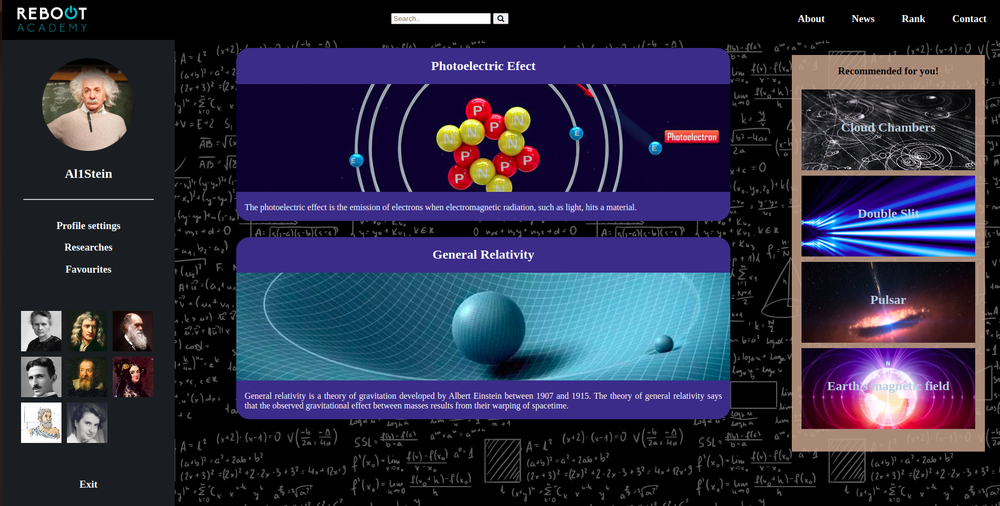
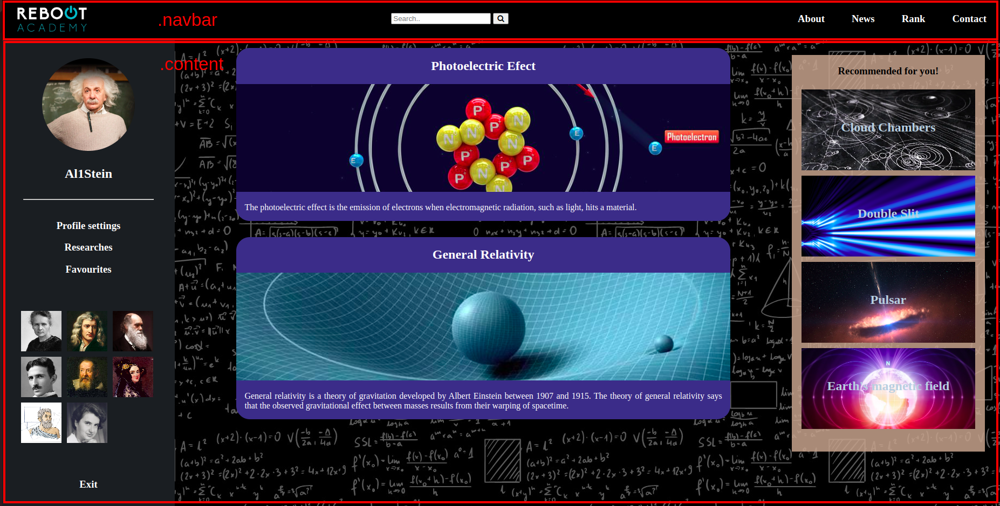

# LAB-CSS-responsive-flexbox

## Introduction

> **_Note:_** _This can be a pair programming activity or done independently._

Today you have learned about flexbox in CSS. The theory is nice, but it's much better to practice patterns in the context of a particular problem!! Let's try today to structure a cool website about physics using flexbox.

Ready?

## Requirements

- [Learn how to fork this repo](https://guides.github.com/activities/forking/)
- Clone this repo into your `code/labs` folder

## Iteration 0 - **Warm up**

First of all, we are going to practice the flexbox basics that we have seen today in class to internalize them. And what better way to do it than with a game? We are going to access the [Flexbox Froggy](https://flexboxfroggy.com) page and we are going to complete all the levels of the game. Once the challenge is overcome, we will send a screenshot to our teacher and we will continue with the next iteration.


## Iteration 1 - **Analizing the structure**

As you can see, there are a `main.css` and a `student.css` files in the `starter-code` folder. Don't worry about the first one, you will write your CSS code in the `student.css` file. There's also an `index.html` file, so let's open it in our browser and...
DON'T PANIC! I know it looks quite awful, but don't worry because we will gradually shape it.

First of all, let's analyse our `index.html` file and identify the different elements in our web page. It should represent something like this:



As we can see, there are two large sections in our body, each one with its class: `navbar` and `content`.

1. Open the `web-view.png` stored in the `images` folder with your favourite image editor and mark each section as follows:



Besides, if we focus on the `navbar` section, we find another 3 elements: an `image`, a `div` and another `div` with the `other-links` class.

2. Mark also those new elements in your image:


If we dig a little deeper, we can see that in the first div, there are an `input` and a `button`, while in the second there are 4 `h3` tags.

3. Mark them in our image:


4. Now it's your turn! Analyze the rest of the `HTML` like we just did with the `navbar` section.


## Iteration 2 - **Mobile View**

Now that we have everything well structured, let's shape our web page. You will focus on the mobile view first, so you reach something like this:


Since `navbar` section contains the three elements we want to distribute, it will be the one that contains the `flex` attributes.

1. Access to `student.css` file and add the following code:

```
.navbar {
  display: flex;
  align-items: center;
  justify-content: space-between;
}
```

However, we don't want to display the `other-links` element in our movile view (this time we will assign the mobile view to a `width` equal to or less than `850px`).

2. To hide this element, assign `display: none` attribute to the `other-links` class using `media queries`>.

```
@media (max-width: 850px) {
  .other-links {
    display: none;
  }
}
```

3. Your turn! Try to shape the rest of the mobile view just like we did with the `navbar` section. Good luck!

## Iteration 3 - **Tablet View**

Now let's shape the tablet view exactly as we did with mobile view.

In the tablet view (`width` less than or equal to `1300px`), we don't want to display the `sidebar` section , so...

1. Use `media query` to hide `sidebar` section using `media queries`.

2. Use `flex` properties to display something like this:


## Iteration 4 - **Web View**

Finally, we want to shape the web view.

1. Assign `flex` properties to the last section (`sidebar`) to display something like this:


## Bonus - **Make it interactive!**

Now the web page is complete, but it seems a little bit... dead. Add some `animations` and CSS `effects` to bring it to life!

## Submission

Upon completion, run the following commands:

```
$ git add .
$ git commit -m "done"
$ git push origin main
```

Then create a Pull Request!!


